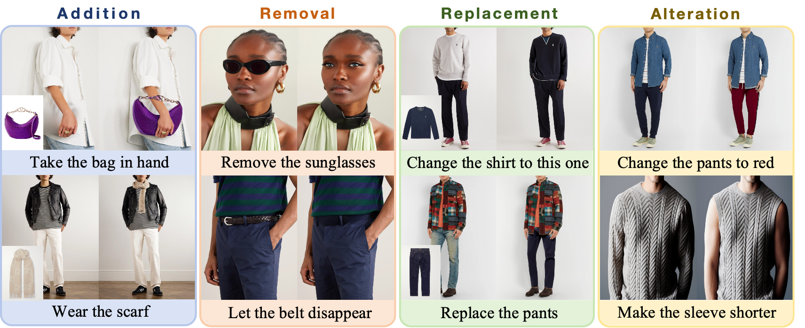
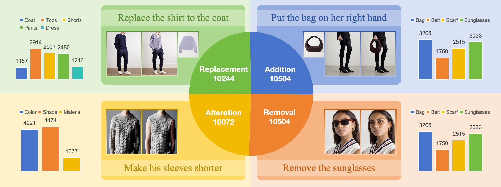

<div align="center">
<h1>TailorEdit: An Adaptive Framework for Instruction-Guided Fashion Image Editing</h1>
</div>

This is the official implementation of the paper ["TailorEdit: An Adaptive Framework for Instruction-Guided Fashion Image Editing"]().

---

&nbsp;

## Requirements

```
git clone https://github.com/zhulingda/TailorEdit.git
cd TailorEdit

conda env create -f environment.yaml
conda activate tailoredit
```


## Dataset
&nbsp;

We constructed a fashion image editing dataset **InstructFashion** for tasks *Addition*, *Removal*, *Replacement*, and *Alteration*, which contains over 40k editing image-text pairs. The original image data comes from [NET-A-PORTER](https://www.net-a-porter.com/) and [shopbop](https://www.shopbop.com/).

The following existing works were mainly used in the process of building data:
1. [Inpait-Anything](https://github.com/geekyutao/Inpaint-Anything) is used to remove a specified object that already exists in the image;
2. [IDM-VTON](https://github.com/yisol/IDM-VTON) is used to create clothing for replacing the target image;
3. [InstructPix2Pix](https://github.com/timothybrooks/instruct-pix2pix) is used to change the specified color or texture for the target image;
4. [Prompt-to-Prompt](https://github.com/google/prompt-to-prompt) is used to generate image pairs with only differences in clothing length;
5. [Segment-Anything](https://github.com/facebookresearch/segment-anything) is used to generate the mask for specified object.

We express our sincere gratitude for the above work. Our dataset will be made public after being organized.


## Training

### Stage 1
In the first stage, the contorlnet for understanding human semantic segmentation maps is required to be finetuned. Running the scripts below, the checkpoint will be saved in ./output.
```
bash ./scripts/finetune_controlnet.sh
```

### Stage 2
In the second stage, the lora adapters for adapting different editing tasks are required to be trained. Running the scripts below, the checkpoint will be saved in ./output. Remember to set the 'lora_task' you want in the script.
```
bash ./scripts/finetune_lora.sh
```

### Stage 3
In the last stage, the gap caused by stage one and stage two will be fixed after finetuning, resulting in a unified editing framework. Running the scripts below, the checkpoint will be saved in ./output.
```
bash ./scripts/train.sh
```


## Inference

### Preparation
There are some model weights need to be download. We suggest you that place all files in "./checkpoints".
- [x] [parsing_prediction_weight](https://drive.google.com/file/d/1aOxfR3zvJYQbVglcF6la8zxyeLC3ykj_/view?usp=drive_link)
- [x] [global_gate_weight](https://drive.google.com/file/d/1bj6Qjfc33naYrff1_H9I8aA7cnuE_XHW/view?usp=drive_link)
- [x] [ip-adapter_sd1.5](https://drive.google.com/file/d/1p6Dtkb-UO0S7Wkj3uzImWp2M3EqXJywE/view?usp=drive_link)
- [ ] [tailor_edit_model]()
- [ ] [controlnet_model]()

### Command
Inference using python file with arguments,

```
python inference.py \
    --image_path "./examples/1.add the scarf/image.jpg" \
    --parsing_path "./examples/1.add the scarf/parsing.png" \
    --instruction_path "add the scarf." \
    --reference_path "./examples/1.add the scarf/reference.jpg" \
```

or, you can simply run with the script file.

```
sh inference.sh
```


## License
The codes and checkpoints in this repository are under the [CC BY-NC-SA 4.0 license](https://creativecommons.org/licenses/by-nc-sa/4.0/legalcode).

